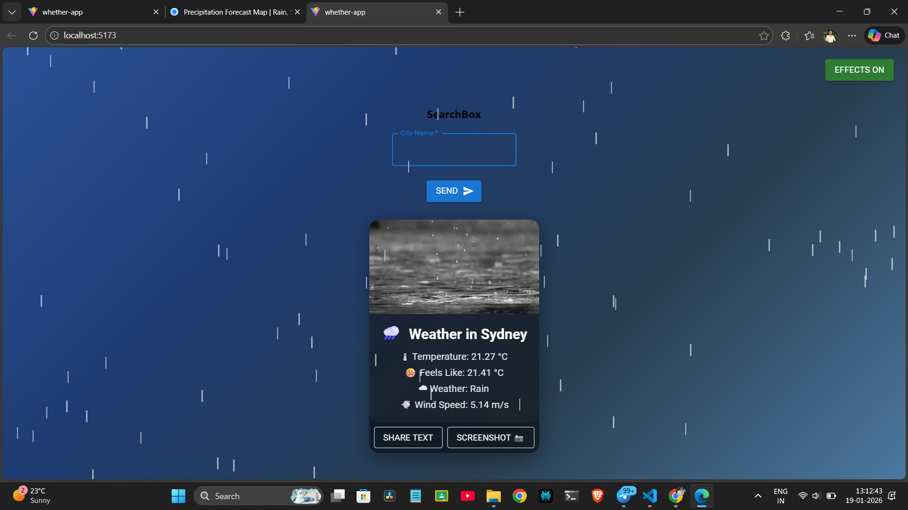

🌦️ Weather App – React Project

A modern and interactive Weather Application built using React.
This project fetches real-time weather data and presents it with a clean UI, animations, and advanced sharing features.

The goal of this project is to demonstrate strong React fundamentals, UI/UX design, and real-world web features.

🚀 Key Features
🔍 City-Based Weather Search

Search weather by entering any city name

Real-time data fetched from OpenWeather API

🌡 Weather Information Display

Current temperature

Feels-like temperature

Weather condition (Clear, Rain, Snow, Thunderstorm, etc.)

Wind speed

🎨 Dynamic & Animated UI

Weather-based background images

Full-page animated gradient background

Glassmorphism-style weather card

Weather icons for better visual understanding

🌧 Weather Effects & Animations

🌧 Rain animation for Rain / Drizzle

❄ Snow animation for Snow

⚡ Lightning flashes during Thunderstorm

🌬 Wind sway effect during Cloudy weather

🎛 Effects Toggle

Toggle button to turn animations ON / OFF

Improves performance and user control

📤 Sharing Features

Share weather details as text

Share weather card as a screenshot image 📸

Mobile: native share (WhatsApp, Instagram, etc.)

Desktop: automatic image download fallback

🛠 Tech Stack

React

Material UI (MUI)

OpenWeather API

HTML2Canvas

CSS Animations

📁 Project Structure
src/
│
├── App.jsx
├── SearchBox.jsx
├── InfoBox.jsx
├── WeatherInfo.jsx
├── WeatherIcon.jsx
├── WeatherBackground.jsx
├── WeatherParticles.jsx
├── EffectToggle.jsx
├── index.css

## 📸 Screenshots

🌤 Weather Card

🌧 Rain / ❄ Snow Effects

⚡ Thunderstorm Effect

📤 Screenshot Share

▶️ How to Run the Project Locally

1️⃣ Clone the repository

git clone <your-github-repo-link>

2️⃣ Navigate to project folder

cd Weather-app

3️⃣ Install dependencies

npm install

4️⃣ Start the development server

npm run dev

5️⃣ Open in browser

http://localhost:5173

🔑 API Used

OpenWeather API
https://openweathermap.org/api

Add your API key inside SearchBox.jsx.

🎯 Learning Outcomes

This project helped me gain hands-on experience with:

React component architecture

State management and props

Conditional rendering

API integration

UI animations and effects

Browser APIs (Share, Clipboard, Screenshot)

Building user-friendly, real-world applications

🚀 Future Enhancements

Dark / Light mode support

Sound effects (rain, thunder)

Progressive Web App (PWA)

Mobile UI optimizations

👤 Author

Swapnil Hingane
Electronics & Telecommunication Engineering
Aspiring Web Developer